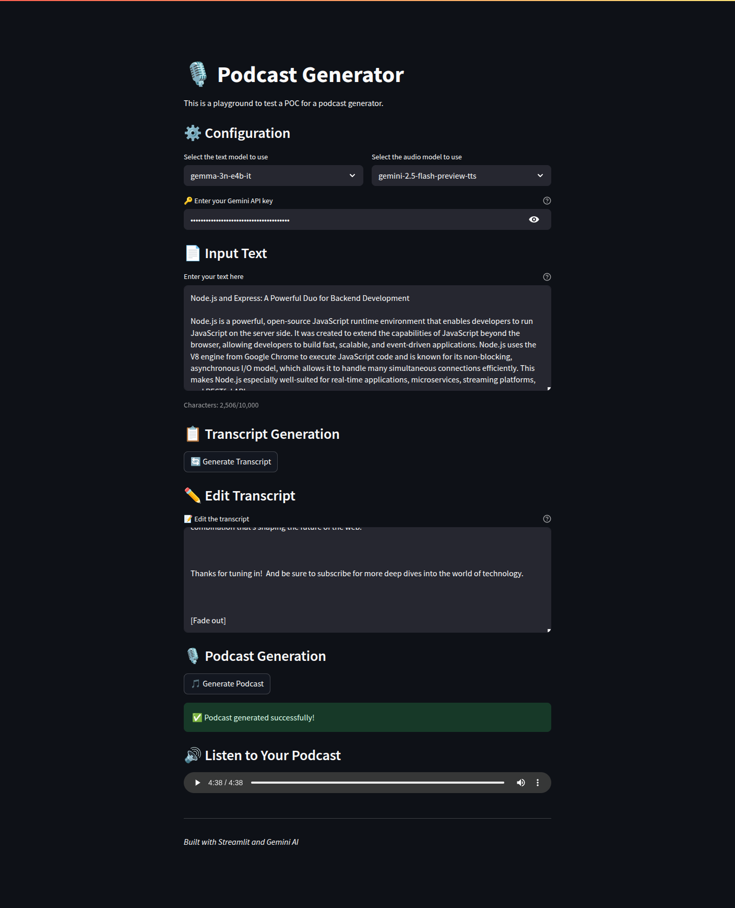

# Podcast Creator - Gemini TTS

An AI-powered podcast creator that transforms your text into engaging educational podcasts using Google's Gemini AI models.

## Setup

### Prerequisites

- Python 3.8 or higher
- Google Gemini API key
- Required Python packages (see requirements below)

### Installation

1. **Clone the repository**

   ```bash
   git clone https://github.com/hdprajwal/podcast-creator.git
   cd podcast-creator
   ```

2. **Install required packages**

   ```bash
   pip install streamlit google-genai python-dotenv
   ```

3. **Set up environment variables**
   Create a `.env` file in the project root:

   ```env
   GEMINI_API_KEY=your_gemini_api_key_here
   ```

4. **Run the application**

   ```bash
   streamlit run app.py

   ```

## Configuration

### API Setup

1. Get a Gemini API key from [Google AI Studio](https://aistudio.google.com/)
2. Add your API key to the `.env` file or enter it directly in the application interface

### Model Options

**Text Models:**

- `gemma-3n-e4b-it`
- `gemini-2.0-flash`
- `gemini-2.5-flash-preview-05-20`

**Audio Models:**

- `gemini-2.5-flash-preview-tts`
- `gemini-2.5-pro-preview-tts`

## Screenshot



## License

This project is licensed under the MIT License - see the [LICENSE](LICENSE) file for details.

## Acknowledgments

- Built with [Streamlit](https://streamlit.io/) for the web interface
- Powered by [Google Gemini AI](https://deepmind.google/technologies/gemini/) for text and audio generation
